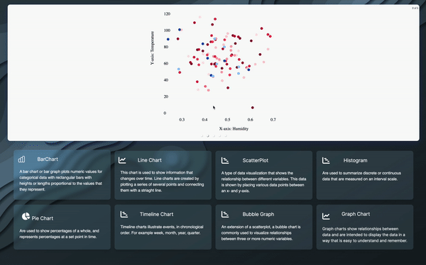
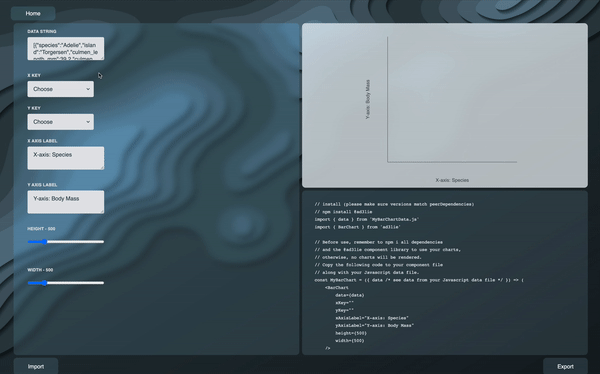
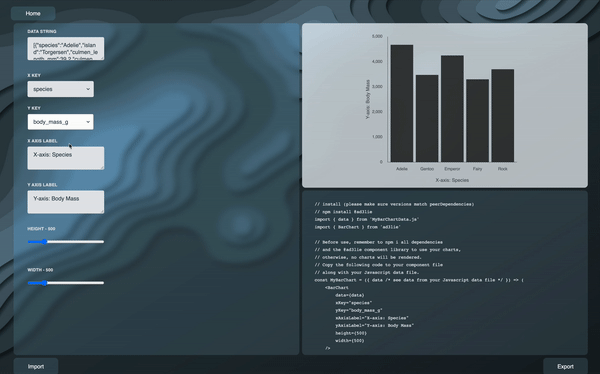

# ad3lie

ad3lie is an open-source application and package for creating elegant and responsive data visualizations built with React and D3.

The focus of this application is to generate user customized charts that can be used in any React project.

# Installation

## Download ad3lie Application

Begin by downloading the app from our [website](https://ad3lie.dev/).

After opening the app, choose which graph to create. Don't worry, if you decide to chose another graph, simply click on the home button and choose another graph from the home page. All of your input data will be saved for the duration of the application's life span.



Input the required fields (i.e. Data, xKey, and yKey) and adjust the graph based on the inputs given





Click the export button and select the file directory of your project for both the data file and React component.


## Install ad3lie Package

Downloading ad3lie will include other necessary dependencies in order to generate your data visualizations. This allows for the use of the React component exported from the ad3lie application.

Simply download the npm package

```
npm i ad3lie
```

OR

```
yarn add ad3lie
```

From here, import the React component as a child component.

```
import Chart from "./file/path/to/component"
```

From here, simply use the componet as you would any other child component in your React app.

### Happy visualizing! <|^o^|>

# Documentation

For more detailed information, please check the related package [documentation](https://docs.ad3lie.dev/) or go directly to our [npm package](https://www.npmjs.com/package/ad3lie).

# How to Setup React App
Make sure to install these npm packages
```
npm i d3
npm i postcss
npm i postcss-loader
npm i autoprefixer
```

tailwind.config.js
```
module.exports = {
  content: ["./client/src/**/*.{html,js}"],
  theme: {
    extend: {},
  },
  plugins: [],
}
```

webpack.config.js
```javascript
const path = require('path');
const HtmlWebpackPlugin = require('html-webpack-plugin');

module.exports = (env) => {
  return {
    mode: env.mode,
    entry: './client/src/index.js',
    output: {
      path: path.resolve(__dirname, 'client', 'build'),
      filename: 'bundle.js'
    },
    module: {
      rules: [{
        test: /\.jsx?/, 
        use: {
          loader: 'babel-loader',
          options: {
            presets: ['@babel/preset-env', 
            '@babel/preset-react'],
             targets: {chrome: "100"}
            
          }
        }
      },
      {
        test: /.+\.css$/i,
        // exclude: /node_modules/,
        use: [
          'style-loader', 
          'css-loader', 
           {
             loader: 'postcss-loader',
             options: {
               postcssOptions: {
                 plugins: {
                  tailwindcss: {},
                  autoprefixer: {},
                }
               }
             }
           }
          ]
      }
    ]
    },
    resolve: {
      extensions: ['', '.js', '.jsx'],
      alias: {
        'react': path.resolve(__dirname, 'node_modules/react'),
      }
    },
    
    plugins: [new HtmlWebpackPlugin({
      template: './client/src/index.html'
    })],
    devServer: {
      static: './client/build',
      port: 8888
    }
  }
}
```

Checkout our [website](https://ad3lie.dev/) to see incoming features, how to get involved, and meet our team!
